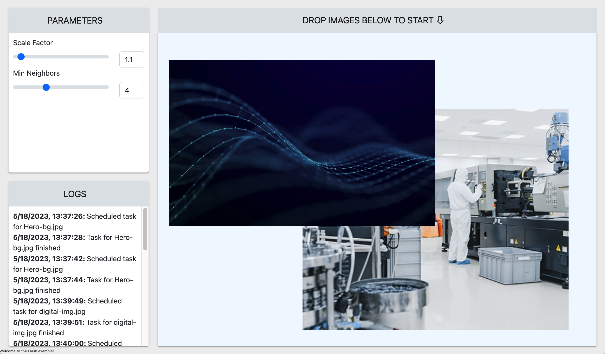
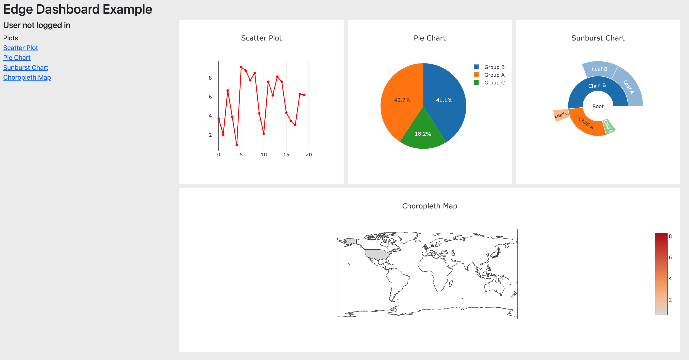
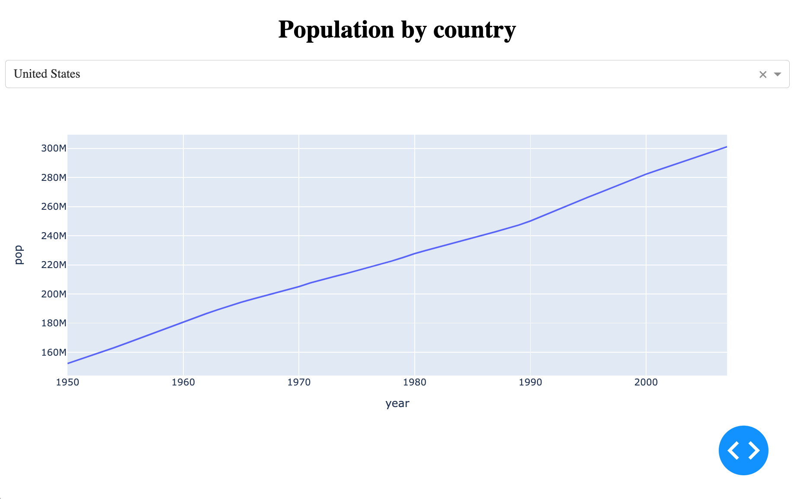
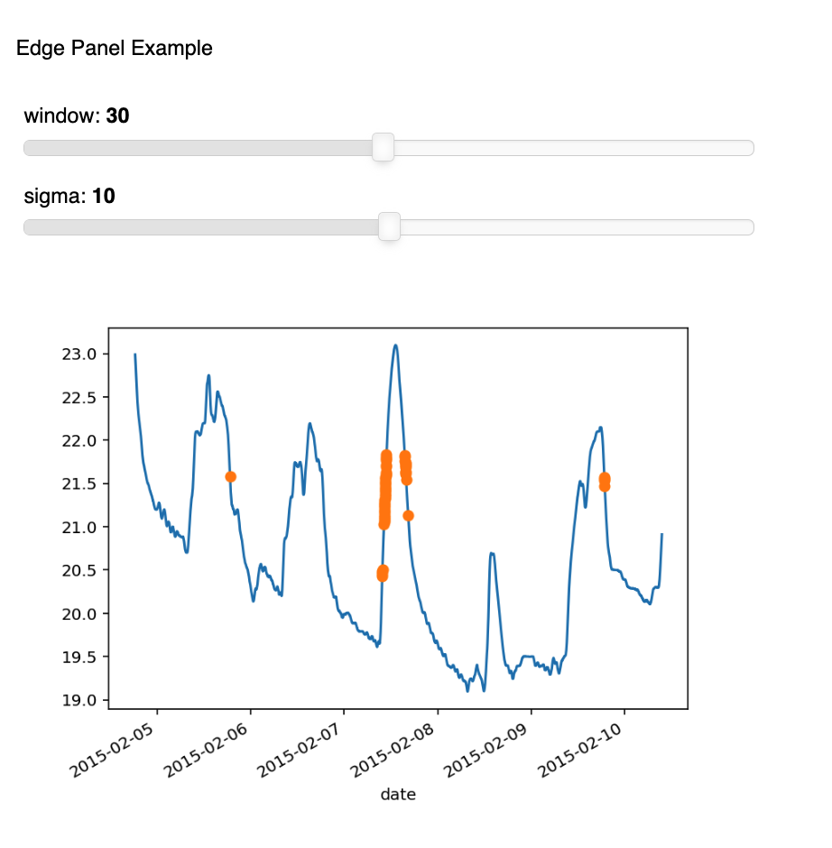
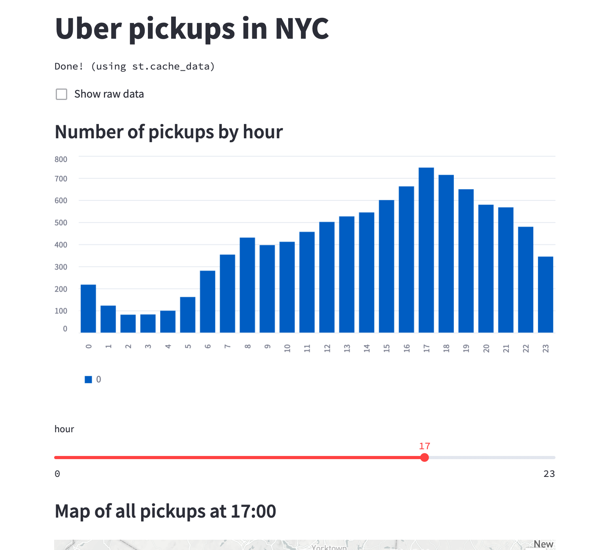

# Edge Examples

Welcome to the Edge examples repo!  This GitHub repo holds working examples of
apps which run on Enthought Edge.  As an Edge developer, you are free to make
copies of the apps here and modify them to add your own functionality.

## Suggested Development Workflow

1. Make a copy of the example you're interested in.

2. Ensure you are able to build and run the example, by following the README
   file in the example's folder.  This will help find problems with your
   development environment, for example missing tools or packages, before you
   start developing.

3. Update the app name and Docker repository information in config.py, to
   put in your own information.

4. Publish your app and register it with Edge.  The example's README will have
   information on how to do this.  More information is also available in the
   [online Edge documentation](https://docs.enthought.com).

5. Log into Edge, and ensure you can launch the app.

6. Modify the example to add your desired functionality.

## Example 1: Flask/React

Located in the [example-flask](example-flask) folder.

This is a simple image-recognition demo, which uses a Flask backend and React
frontend.  It leverages the OpenCV library to detect faces in an uploaded
image.

## Example 2: Dashboard

Located in the [example-dashboard](example-dashboard) folder.

This is a smaller example, demonstrating how to build a minimal "dashboard"
app with plots, graphs, and other widgets.

## Example 3: Plotly Dash

Located in the [example-plotly-dash](example-plotly-dash) folder.

This demonstrates how to use [Plotly Dash](https://plotly.com/dash/) to build
a visualization-based science app.

## Example 4: Panel

Located in the [example-panel](example-panel) folder.

This app demonstrates how to use [Panel](https://panel.holoviz.org/) to build 
an Edge app.

## Example 5: Streamlit

Located in the [example-streamlit](example-streamlit) folder.

Demonstrates the use of [Streamlit](https://streamlit.io/) to build Edge apps.

## Externally-Hosted App

Located in the [example-external](example-external) folder.

This shows how to add a tile to the Edge workbench, which points at a service
running outside of Edge.  It also demonstrates how to use Edge as an
authentication backend for your app.